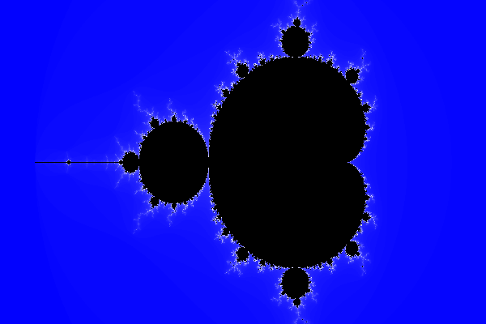
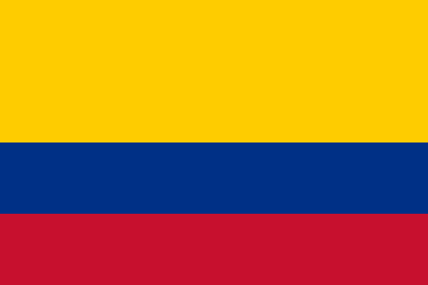
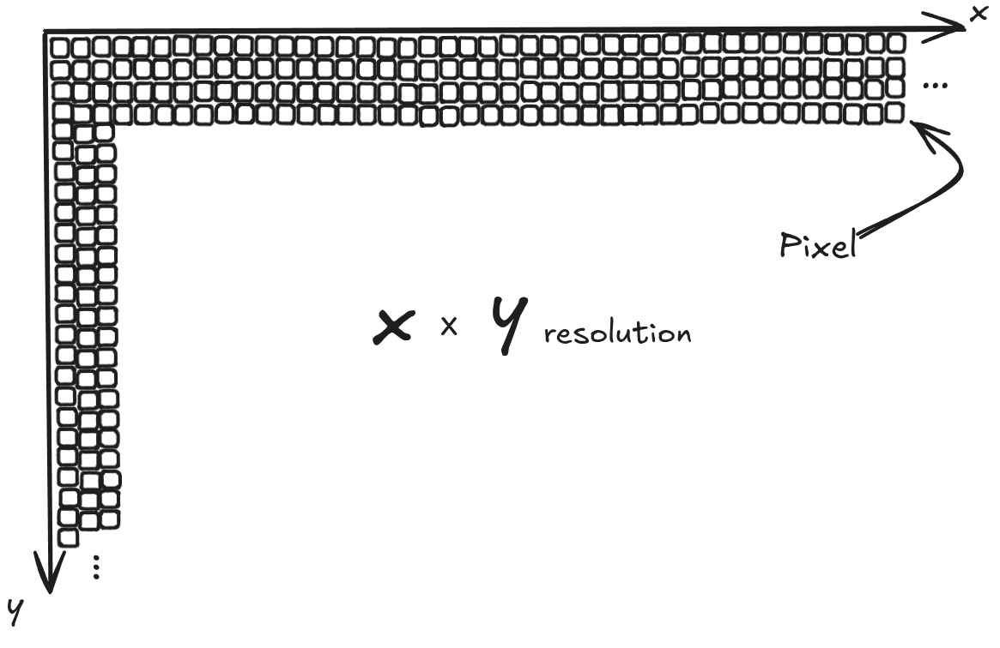

# C++ Software Rasterizer





A simple CPU-based rasterizer that generates `.ppm` images from scratch using raw pixel manipulation in C++ - no graphics libraries.

---

## How it works

A screen is made of pixels, where each pixel stores an RGB colour.

Images are constructed by filling a 2D grid of pixels.

---

## Pixel Coordinates

Screens use a 2D coordinate system:

- x increases → right  
- y increases → down  


Each (x, y) maps directly to a pixel in memory.

---

## RGB Colour Model

Each pixel is:

R G B

Each value ranges:
- 0 = OFF
- 255 = FULL INTENSITY

Examples:
- Black → 0 0 0  
- White → 255 255 255  
- Red → 255 0 0  

Reference: https://en.wikipedia.org/wiki/RGB_color_model

---

## PPM Format

Images are stored as plain text `.ppm` files:

P3  
# image.ppm  
600 400  
256  

Followed by RGB values per pixel.

More info: https://en.wikipedia.org/wiki/Netpbm

---

## What this project includes

- Pixel framebuffer in C++
- Manual RGB image generation
- Rectangle filling
- Flag rendering using layered regions
- Export to `.ppm` format

---

## Example Output

Colombia Flag generated using pure C++:


---

## Build & Run

```bash
g++ src/main.cpp -o raster
./raster
xdg-open output.ppm
```

---

## Goal

Understand how images are built from raw pixels and how screen coordinates map to memory.
